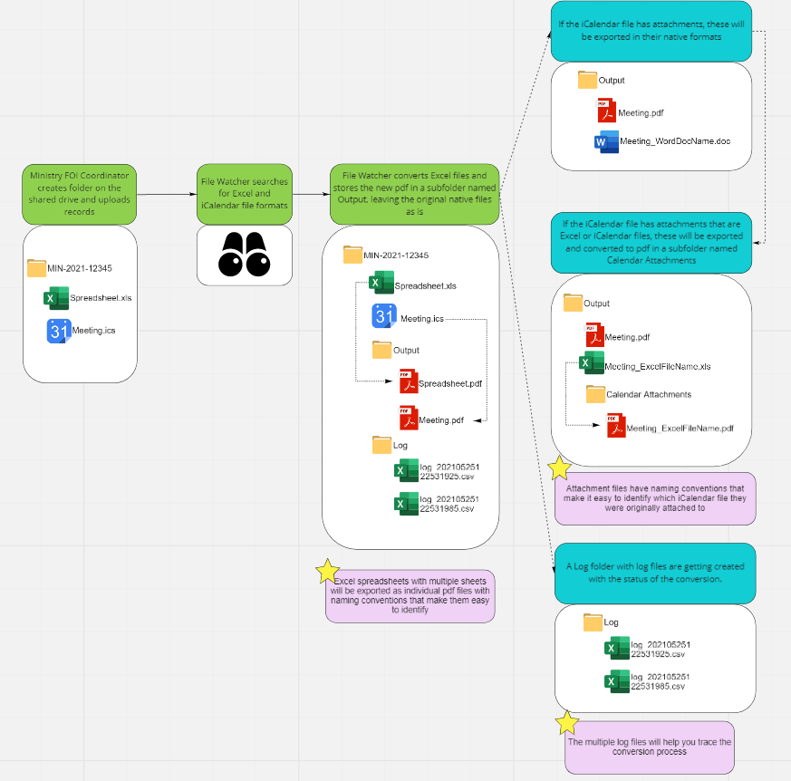

# FOI File Conversion

## Introduction
FOI-File-Conversion is a backend process to convert Excel (.xls, .xlsx) and iCalendar(.ics) files to pdf so that it can be loaded to Intella for deduplication and export to pdf. Current Intella software is having issue while converting these problematic file type to pdf for further processing in AXIS. This is has been tackled using this FOI-File-Conversion background process.

This process include a File watcher, a processor for excel files and a processor for iCalendar files. File watcher will keep on watching the Shared LAN for problematic file types and the respective processor pick up the files based on the file type and convert to pdfs.

Note : As part of the development of FOI File conversion component, a third party tool/SDK called "File Formats" from Syncfusion has been utilized. This tool comes up with a paid license which need to be procured seperately in order to further utilize this code base with other projects.

# File Watcher and Conversion Flow



# System Requirements

* .NET Core 3.1

# Code Repo/Solution structure
```
├──LICENSE
├──README.md
├──MCS.FOI.FilePreProcessor
       ├──MCS.FOI.CalenderToPDF
                ├──CalendarFileProcessor.cs
       ├── MCS.FOI.ExcelToPDF
                ├──ExcelFileProcessor.cs
       ├── MCS.FOI.FileConversion
                ├──FileWatcher
                    ....
                ├──Logger
                ├──Utilities
                ...
       ├── MCS.FOI.CalenderToPDF.UnitTests
                ├──CalendarFileProcessorTest.cs
       ├── MCS.FOI.ExcelToPDF.UnitTests
                ├──ExcelToPDFTests.cs
 ```
# License
This code base uses a third party paid-product called "File Formats" from Syncfusion. The current libraries referred uses a trial version from Syncfusion, which is NOT intended for production use. Please refer to [Syncfusion License agreement](https://www.syncfusion.com/license/studio/19.1.0.63/syncfusion_essential_studio_eula.pdf)
# Unit test

There are two seperate unit test case projects for Excel and Calender file conversions. Refer the MCS.FOI.FilePreProcessor/unittest.bat . These unit tests requires 2 environment variables for the execution "HTMLtoPdfWebkitPath" (path to the webkit folder - included in the code base) and "SourceRootPath", which is the path the sample conversion files inside the unit tests

